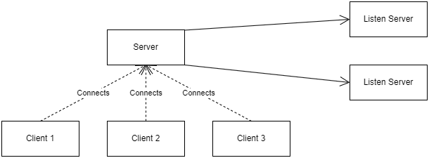
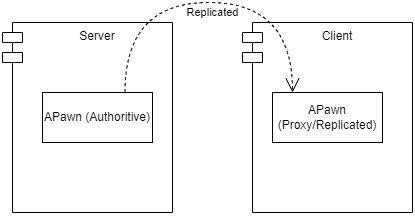

# Networking in Unreal Engine 5
## About the project
This project is a recreation of a well-known game developed by Valve - Left4Dead2.  
The point of this project is to learn how networking works in Unreal Engine 5.  
Everything (assets, code, blueprints) is included in this repository.
## Index
1. [Basic Overview.](#basic-overview)  
1.1. [Client-Server Architecture.](#client-server-architecture)  
1.2. [What Is Replication?](#what-is-replication)
2. [Replication.](#replication)  
2.1. [Replication Conditions.](#replication-rules)  
3. Server-Side Code and Client-Side Code.  
3.1. Local Roles.  
3.2. Locally Controlled.
## Basic Overview
Unreal Engine 4 and 5 provide tools and the networking framework that allow to develop multiplayer experiences. When developing a game, a decision if the game will include the multiplayer has to be done at the beggining of the development process. Seen that multiplayer games can have limitations, the game design and the implementation have to be done with networking in mind.
### Client-Server Architecture
As everything that has networking, games are developed using the Client-Server pattern in UE5. The game's logic runs on the server (dedicated, listen) and clients connect to it.  



The server is the authoritive machine. It runs the game and has the game's state that is replicated to all clients. This way the decisions related to the game's logic are made by the server. There are two types of servers:

|Server Type|Description|Pros|Cons|
|--|--|--|--|
|Listen Server|Is run by a user's local machine and other users can connect to that machine. The game has to include some kind of UI that will allow the player to lunch a server or connect to someone.|Is easy to set up. Suitable for small games.|The client that is running the server will experience problems with performance, because of the rendering code and hosting the server. Also by being the server, the player can cheat.|
|Dedicated Server|Is run on a separate, dedicated machine, and the clients connect to it.|Doesn't run the rendering code, suitable for big sessions.|Harder to set up.|

If the game has beem implemented with the multiplayer in mind, but is shipped as a standlone application, there will be no overhead with the multiplayer code.
### What Is Replication
Replication is a process of sending the information of actors' states from the server to clients. The server runs the game and has its own version of the world. All actors inside this world are called autoritive actors and the game's logic is run on them. All actors on the client side are called replicated (proxy) and their states are replicated to clients.   

When a client sends tries to change the game's state (move the character, shoot from the gun, pick up an item), the information is sent to the server in the form of a package. The server processes the package, and if everything's OK, changes the state of the game, and replicates everything to clients.



#### Replicated
In UE5, only `Actors` can be replicated. Everything that is not an actor won't be replicated. However any `UObject` that is attached to an actor will be replicated. By default, the creation and destruction are replicated. Everything else has to handled by the developers. 

Set `bReplicates` to `true` in the constructor of the authorative actor to enable the replication.  
Set `bReplicateMovement` to `true` in the constructor of the authorative actor's movement component to replicate its position, rotation and velocity.

|Feature|Description|
|--|--|
|Properties|properties of actors that are marked with `Replicated` or `ReplicatedUsing` will be replicated.|
|Components|properties of components that are marked with `Replicated` or `ReplicatedUsing` will be replicated. The component will be replicated if it is attached to the actor that's being replicated and has been marked as replicated.|
|Subobjects|Any UObject attached to an actor can be replicated.|
|Remote Procedure Calls (RPCs)|RPCs are special functions that are run on other machines. These may be designed as Server, Client or NetMulticast|

Several common features of actors, pawns, and characters do not replicate, such as:
* Skeletal Mesh Component
* Static Mesh Component
* Materials
* Animation Blueprints
* Particle System Component
* Sound Emitters
* Physics Objects

## Replication
To replicate an actor, its `bReplicates` has to be set to true in it's constructor. By doing so, the actor now will be replicated when it's spawned in the world.  
A property should be marked with `Replicated` or `ReplicatedUsing` to be replicated.

```C++
UPROPERTY(ReplicatedUsing = OnRep_CurrentHealth)
float CurrentHealth;
```

`OnRep_CurrentHealth` is a repnotify and it'll be called on the client side when the replication of the variable is successfully done. A repnotify is a `UFUNCTION`.

```C++
UFUNCTION()
void OnRep_CurrentHealth();
```

The `GetLifetimeReplicatedProps` function is responsible for replicating any properties that have been marked with the Replicated specifier, and enables the ability to configure how a property will replicate.

```C++
virtual void GetLifetimeReplicatedProps(TArray<FLifetimeProperty>& OutLifetimeProps) const override;
```

The `DOREPLIFETIME` macro that is defined in `"Net/UnrealNetwork.h"` is the most basic type of replication.

```C++
void AThirdPersonMPCharacter::GetLifetimeReplicatedProps(TArray<FLifetimeProperty>& OutLifetimeProps) const
{
	Super::GetLifetimeReplicatedProps(OutLifetimeProps);

	DOREPLIFETIME(AThirdPersonMPCharacter, CurrentHealth);
}
```

### Replication Conditions